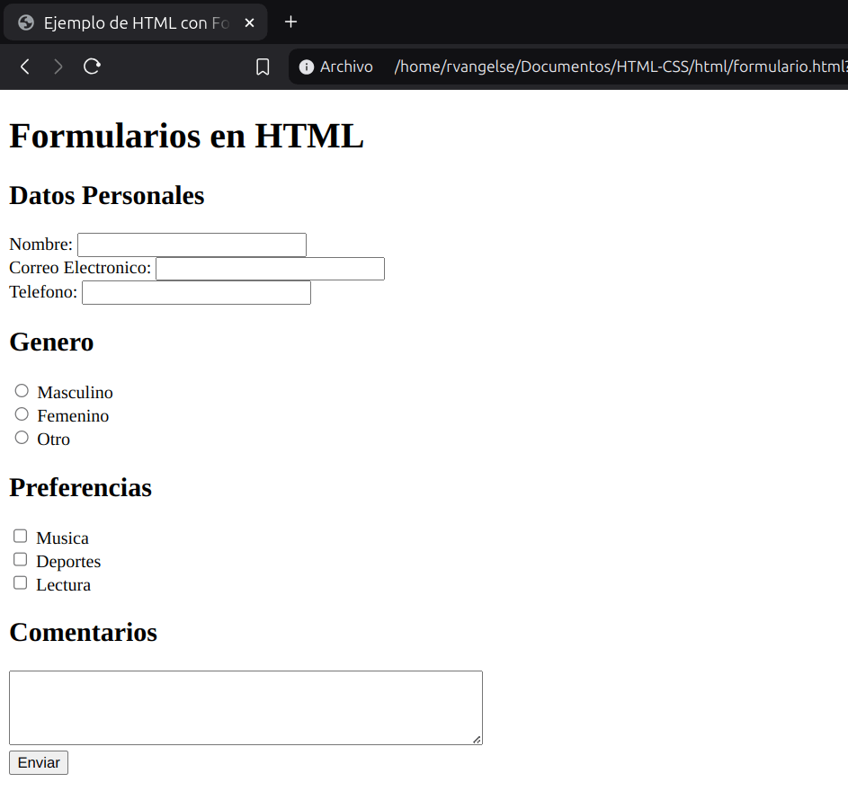

# Formularios
### Entrada
```html
<input type="password" />
<input type="search" />
<input type="tel" placeholder="543-766-2344"/>
<input type="date" />
<input type="color" />
<input type="file" accept="image/*" multiple/>
<input type="checkbox" value="El checkbox está marcado" />
```
OJO: No validar o sanitizar correctamente los datos ingresados por el usuario puede conducir a vulnerabilidades de seguridad, como ataques de inyección de código o cross-site scripting (XSS). 

### Area de Texto
```html
<textarea cols="20" rows="10"></textarea>
```
OJO: Utiliza el atributo `maxlength` para limitar la cantidad máxima de caracteres permitidos en el campo de texto. 

### Campos
```html
<fieldset><!-- Sirve para agrupar inputs -->
    <legend>Checkboxes</legend> <!-- Titulo -->
    <input id="uno" type="checkbox" value="Uno" />
    <label for="uno">Uno</label> <!-- El "for" relaciona al label con el id-->
    <input id="dos" type="checkbox" value="Dos" /> 
    <label for="dos">Dos</label>
    <input id="tres" type="checkbox" value="Tres" />
    <label for="tres">Tres</label>
</fieldset>

<fieldset>
    <legend>Radio Buttons</legend>
    <input id="uno" type="radio" value="Uno" />
    <label for="uno">Uno</label>
    <input id="dos" type="radio" value="Dos" />
    <label for="dos">Dos</label>
    <input id="tres" type="radio" value="Tres" />
    <label for="tres">Tres</label>
</fieldset>
```
OJO: Siempre asegurate de agregar el atributo 'name' a cada campo del formulario, y de asignarle un nombre único y descriptivo. Esto garantizará que los datos se envíen correctamente al procesamiento y permitirá identificar cada campo de forma adecuada.

### Formularios
```html
<form action="/action.php" method="POST"> <!-- URL y metodo para el envio del formulario al Back-End -->

    <label for="name">Nombre:</label>
    <input id="name" name="name" />
    <br/>
    <label> <!-- Otra forma de asociar una label con un input-->
        email:
        <input name="email" type="email" required placeholder="miemail@ejemplo.com" />
    </label>
    <br/>
    <button>Iniciar Sesión</button>
</form>
```
---
### Practica 8: Formularios en HTML

**Codigo**
```html
<!DOCTYPE html>
<html lang="es">
<head>
    <meta charset="UTF-8">
    <meta name="viewport" content="width=device-width, initial-scale=1.0">
    <title>Ejemplo de HTML con Formularios</title>
</head>
<body>
    <header>
        <h1>Formularios en HTML</h1>
    </header>
    <main>
        <section>
            <form action="#" method="post">
                <h2>Datos Personales</h2>
                <label>
                    Nombre:
                    <input type="text" name="nombre" id="nombre" required> <br>
                </label>
                <label>
                    Correo Electronico: 
                    <input type="email" name="correo" id="correo" required> <br>
                </label>
                <label>
                    Telefono: 
                    <input type="tel" name="telefono" id="telefono"> <br>
                </label>
                <h2>Genero</h2>
                <label>
                    <input type="radio" name="genero" value="masculino"> 
                    Masculino <br>
                </label>
                <label>
                    <input type="radio" name="genero" value="femenino"> 
                    Femenino <br>
                </label>
                <label>
                    <input type="radio" name="genero" value="otro"> 
                    Otro <br>
                </label>
                <h2>Preferencias</h2>
                <label>
                    <input type="checkbox" name="preferencias[]" value="musica"> 
                    Musica <br>
                </label>
                <label>
                    <input type="checkbox" name="preferencias[]" value="deportes"> 
                    Deportes <br>
                </label>
                <label>
                    <input type="checkbox" name="preferencias[]" value="Lectura"> 
                    Lectura <br>
                </label>
                <h2>Comentarios</h2>
                <textarea name="comentarios" id="comentarios" cols="50" rows="4"></textarea> <br>
                <input type="submit" value="Enviar">
            </form>
        </section>
    </main>
</body>
</html>
```
**Output**

<p align="center">
  
</p>