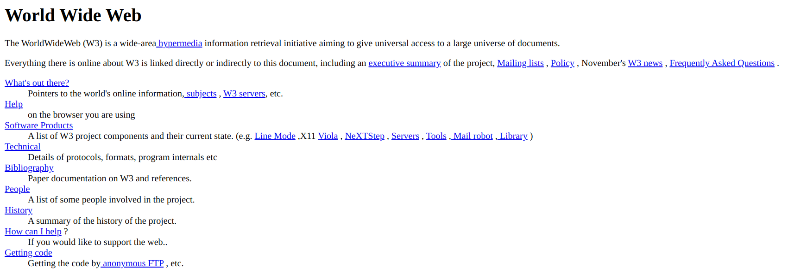
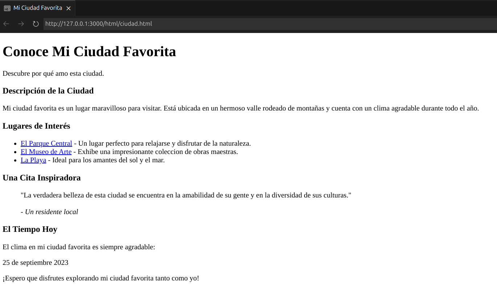
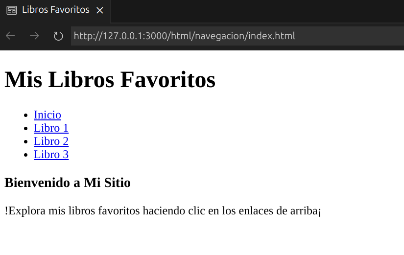
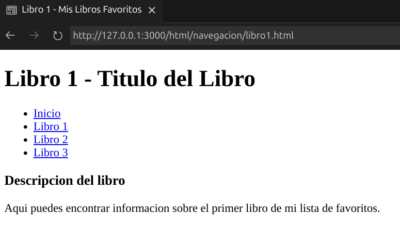
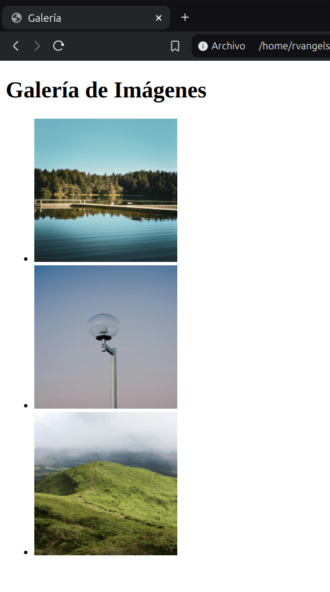
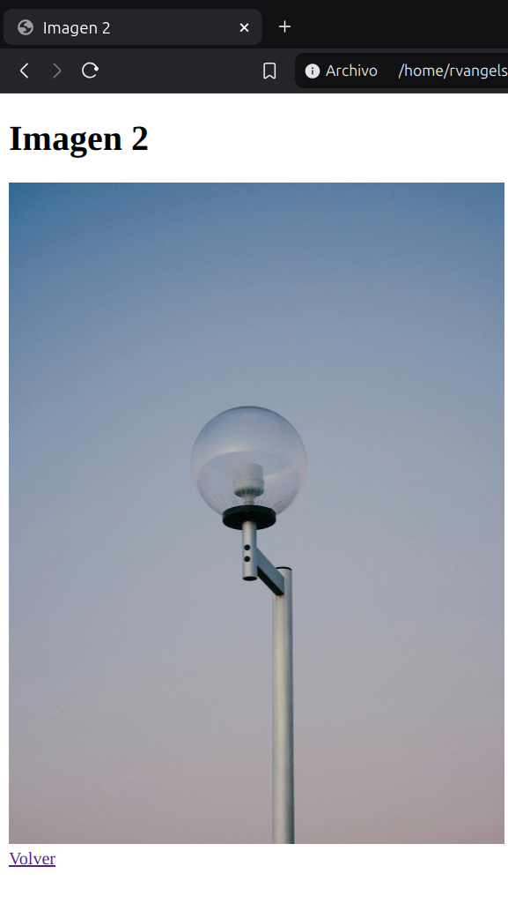
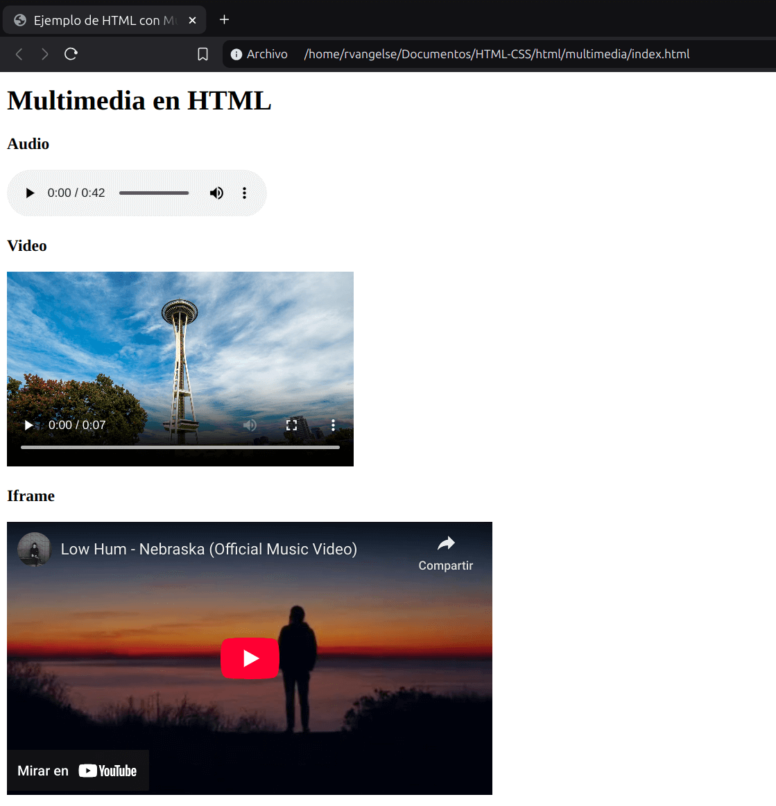
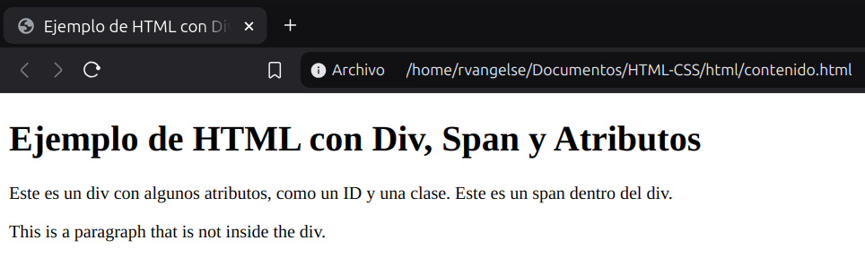
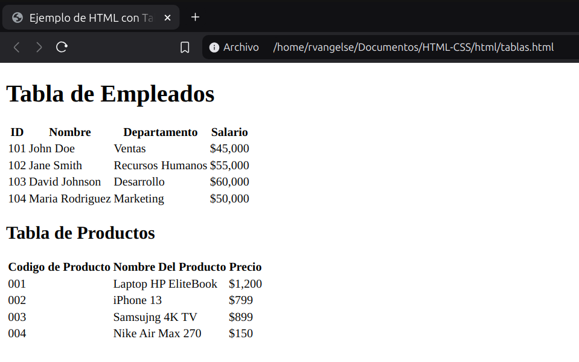

# HTML

HTML (HyperText Markup Language) es un lenguaje de marcado de texto. Define la estructura y el contenido de una pagina web. Es un lenguaje de alto rendimiento, interpretado y de codigo abierto. Fue creado por Tim Berners-Lee en 1990.

<p align="center">
  
</p>

---

### Estructura básica de HTML en una página Web

<p align="center">
  
</p>

- Container: Contenedor principal
- Header: Cabecera de la página. Aquí usualmente encuentras el logo y el menú de navegación del sitio.
- Main content: Estructura principal. Por ejemplo, el feed o lista de publicaciones de una red social.
- Sidebar: Contenido secundario de una página, que usualmente se encuentra a los lados del contenido principal (o main).
- Footer: Pie de página. Esto se encuentra al fondo del sitio web, salvo en casos de sitios web donde el scroll (o navegación hacia abajo) es infinito, por ende, no tendría sentido ponerlo al fondo.

---

### Document Object Model (DOM)

Es el arbol que se forma en el archivo html, es decir, la representacion del HTML en tu pagina.

La raíz de la estructura de árbol de HTML es la etiqueta `<html>`, que contiene dos
nodos principales: `<head`> y `<body>`

---

### Index y su estructura básica: head

El primer archivo .html en tu proyecto debe llamarse `index.html`, es la primera pagina que va abrir el servidor, por default, al abrir tu proyecto.
Si no lo haces e `index.html` no existe, el servidor te devolvera toda la estructura de carpetas de archivos de tu proyecto.

En el `head` van todos los metadatos importantes para que el navegador pueda cargar el proyecto. Esto no es visual para el usuario.

``` html
<!DOCTYPE html>
<html lang= "es"> 
    <head>
        <meta charset= "UTF-8" />
        <meta name="description" content="Esta pagina te mostrara fotos de gatos" />
        <meta name="robots" content="index,follow"/>
        <title>Es mi pagina</title>
        <meta name="viewport" content="width=device-width, initial-scale=1.0"/>
        <link rel="icon" href="/favicon.ico" /> <!-- Icono -->
        <link rel="preload" href="/font.woff2" as="font" type="font/woff2" crossorigin="anonymous" /> <!-- Fuente importada -->
        <link rel="stylesheet" href="css/style.css" /> <!-- CSS -->
        <script src="js/script.js"></script> <!-- JS -->
    </head>
</html>
```
---

### Index y su estructura básica: body

El `body` es la etiqueta que identifica la parte visible de nuestro sitio web. Dentro del `body`, se añadirán las etiquetas para marcar los elementos visuales del sitio web, como logotipo, menús de navegación, contenido principal, entre otros.

```html

<!-- Estructura Semántica-->
<!DOCTYPE html>
<html lang= "es">
<body>
    <nav></nav>
    <!-- Encabezado -->
    <header>
        <h1></h1>
    </header>
    <!-- Contenido principal -->
    <main>
        <!-- Artículo: Unidad de información -->
        <article></article>
        <!-- Secciones de contenido -->
        <section></section>
        <!-- Contenido de lado -->
        <aside></aside>
    </main>
    <!-- Pie de página -->
    <footer></footer>
</body>

```
OJO: No uses divs ni tablas para agrupar contenido. Usa etiquetas semánticas.

---

### Anatomía de una etiqueta de HTML

<p align="center">
  
</p>

---

### Texto

**Texto Semantico**

Etiquetas que ayudan a dar más significado a palabras o frases.

``` html
<!-- Ejemplos: -->
<p>Párrafo (Elemento de Bloque)</p>
<em>Énfasis</em>
<i>Voz alternativa</i>
<b>Atención utilitaria</b>
<strong>Gran importancia</strong>
<small>Pequeño comentario</small>
<span>Uso con atributos (Elemento de Línea)</span>

<!-- Truco para evitar salto de línea -->
<p>Estas&nbsp;palabras&nbsp;no&nbsp;saltan&nbsp;líneas&nbsp;en&nbsp;ventanas&nbsp;pequeñas</p>

```
**Encabezados**

``` html
<!-- Encabezados -->
<h1>Título</h1>
<h2>Subtítulo</h2>
<h3>Subtítulo</h3>
<h4>Subtítulo</h4>
<h5>Subtítulo</h5>
<h6>Subtítulo</h6>
```
OJO: Es una buena practica tener un solo titulo por pagina. 

**Listas**
```html
<!-- Listas desordenadas -->
<ul>
    <li>HTML</li>
    <li>CSS</li>
    <li>JavaScript</li>
</ul>
<!-- Listas ordenadas -->
<ol>
    <li>HTML</li>
    <li>CSS</li>
    <li>JavaScript</li>
</ol>
<!-- Listas de definición -->
<dl>
    <dt>HTML</dt>
    <dd>Es un lenguaje de marcado de texto.</dd>
    <dd>Se utiliza para el desarrollo de páginas de Internet.</dd>
</dl>
```
OJO: Es recomendable el uso de listas anidadas, si las listas son demasiado largas.

**Formato**

``` html

<!-- Codigo -->
<p>Utiliza este código en CSS:
    <code>{ background: blue; }</code>
</p>

<p>Utiliza este código en HTML:
    <code>&lt;body&gt;</code>
</p>

<!-- Superíndice y subíndice -->
<p>CO<sub>2</sub></p>
<p>n<sup>2</sup></p>
<p>Referencia a un libro.<sup>1</sup></p>

```
**Citas**

``` html
<blockquote> <!--En bloque-->
    Primero, las máquinas harán muchos trabajos por nosotros y no serán súper inteligentes. Eso debería ser positivo si lo gestionamos bien. Unas décadas después de eso, la IA puede ser bastante fuerte como para ser una preocupación. <sup>[1]</sup>
</blockquote>
<p>1."<cite>Bill Gates dice que deberías preocuparte por la inteligencia artificial</cite>". Forbes. Febrero de 2015.</p>


<p>José Mujica dijo: <!--En linea (Citas Cortas)-->
    <q>Ser libre es gastar la mayor cantidad de tiempo de nuestra vida en aquello que nos gusta hacer.</q>
</p>

```
**Tiempo** 

```html 

<!-- Fechas y Tiempo -->
<p>Nos vemos a las 
    <time datetime="2024-04-20 10:00-0800">10</time>
</p>

```
---

### Practica 1: Lista de Compras

**Codigo**

``` html

<!DOCTYPE html>
<html lang= "es"> 
    <head>
        <meta charset= "UTF-8" />
        <meta name="description" content="Esta pagina es mi lista de compras" />
        <meta name="robots" content="index,follow"/>
        <title>Lista de Compras</title>
        <meta name="viewport" content="width=device-width, initial-scale=1.0"/>
        <link rel="stylesheet" href="../css/styles.css">
    </head>
    <body>
        <main>
            <h1>Lista de Compras</h1>
            <ul>
                <li>Carnes</li>
                    <ol>
                        <li>Pechuga de Pollo🐔</li>
                        <li>Pescado🐠</li>
                        <li>Res🥩</li>
                    </ol>
                <li>Vegetales</li>
                    <ol>
                        <li>Aguacate🥑</li>
                        <li>Zanahorias🥕</li>
                        <li>Tomates🍅</li>
                    </ol>
                <li>Frutas</li>
                    <ol>
                        <li>Cerezas🍒</li>
                        <li>Arandanos🫐</li>
                        <li>Frutillas🍓</li>
                    </ol>
            </ul>
        </main>
        <footer>
            <p>Febrero, 2025</p>
        </footer>
    </body>
</html>

```
**Output**

<p align="center">
  
</p>

---
### Practica 2: Mi Ciudad Favorita

**Codigo**

``` html
<!DOCTYPE html>
<html lang="es">
  <head>
    <meta charset="UTF-8" />
    <meta name="viewport" content="width=device-width, initial-scale=1.0" />
    <title>Mi Ciudad Favorita</title>
  </head>
  <body>
    <header>
      <h1>Conoce Mi Ciudad Favorita</h1>
      <p>Descubre por qué amo esta ciudad.</p>
    </header>
    <main>
      <section>
        <h3>Descripción de la Ciudad</h3>
        <p>
          Mi ciudad favorita es un lugar maravilloso para visitar. Está ubicada
          en un hermoso valle rodeado de montañas y cuenta con un clima
          agradable durante todo el año.
        </p>
      </section>
      <section>
        <h3>Lugares de Interés</h3>
        <ul>
          <li>
            <a href="#">El Parque Central</a> - Un lugar perfecto para relajarse
            y disfrutar de la naturaleza.
          </li>
          <li>
            <a href="#">El Museo de Arte</a> - Exhibe una impresionante
            coleccion de obras maestras.
          </li>
          <li>
            <a href="#">La Playa</a> - Ideal para los amantes del sol y el mar.
          </li>
        </ul>
      </section>
      <section>
        <h3>Una Cita Inspiradora</h3>
        <blockquote>
          "La verdadera belleza de esta ciudad se encuentra en la amabilidad de
          su gente y en la diversidad de sus culturas." <br />
          <br />
          <cite>- Un residente local</cite>
        </blockquote>
      </section>
    </main>
    <footer>
      <section>
        <h3>El Tiempo Hoy</h3>
        <p>El clima en mi ciudad favorita es siempre agradable:</p>
        <time daytime="2023-09-5">25 de septiembre 2023</time>
        <p>
          ¡Espero que disfrutes explorando mi ciudad favorita tanto como yo!
        </p>
      </section>
    </footer>
  </body>
</html>
```
**Output**

<p align="center">
  
</p>

---
### Navegacion

**Vinculos**
```html

<!-- Enlace a otra pagina -->
<p><a href="ciudad.html">Ir a Mi Ciudad Favorita</a></p> 

<!-- Enlace a otra seccion dentro de la misma pagina -->
<p><a href="#ancla">Ir a ancla</a></p>
<!-- Simulación de bastante contenido -->
</img>
<section id="ancla">Ancla</section>
</img>
```
OJO: Si deseas abrir el vínculo en una nueva página, puedes usar el atributo target='_blank'

**Rutas**
```html
<!-- Vínculos Relativos -->
<a href="./about.html">About</a> <!-- Relativo a la carpeta actual, se puede omitir el "." -->
<a href="../index.html">Index</a> <!-- Ralativo a la carpeta padre -->

<!-- Vínculo Absoluto -->
<a href="https://www.google.com/">Google</a>

```

OJO: Es recomendable usar rutas relativas cuando sea posible, a menos que desees apuntar a una página externa. 

OJO: Puedes usar la etiqueta `<base>` para asignar una ruta y relacionar al resto de tus archivos, de forma relativa.

OJO: Una buena forma de documentar la estructura de tu sitio es usando un archivo [sitemap](https://developers.google.com/search/docs/crawling-indexing/sitemaps/build-sitemap?hl=es).

**Barras**
```html
<!-- Barras de Navegación -->
<nav role="navigation" aria-label="menú principal">
    <a href="/">Hogar</a> <!-- Este enlace te lleva a la pagina principal de tu dominio-->
    <a href="/blog.html">Blog</a>
    <a href="/sections/about.html">Acerca De</a>
</nav>

<!-- El footer tambien sirve para navegar -->
<footer>
    <a href="/">Hogar</a>
    <a href="/blog.html">Blog</a>
    <a href="/sections/about.html">Acerca De</a>
</footer>
```
OJO: Al utilizar la etiqueta `<nav>`, asegúrate de que su contenido esté relacionado con la navegación principal de tu sitio web, como menús y enlaces que guían a los usuarios a diferentes secciones. 

---
### Practica 3: Mis Libros Favoritos

**Codigo**

```html 
<!--Index-->

<!DOCTYPE html>
<html lang="es">
<head>
    <meta charset="UTF-8">
    <meta name="viewport" content="width=device-width, initial-scale=1.0">
    <title>Libros Favoritos</title>
</head>
<body>
    <header>
        <h1>Mis Libros Favoritos</h1>
        <nav>
            <ul>
                <li><a href="index.html">Inicio</a></li>
                <li><a href="libro1.html">Libro 1</a></li>
                <li><a href="libro2.html">Libro 2</a></li>
                <li><a href="libro3.html">Libro 3</a></li>
            </ul>
        </nav>
    </header>
    <main>
        <section>
            <h3>Bienvenido a Mi Sitio</h3>
            <p>!Explora mis libros favoritos haciendo clic en los enlaces de arriba¡</p>
        </section>
    </main>
</body>
</html>

<!-- Libro 1 -->

 <!DOCTYPE html>
<html lang="es">
<head>
    <meta charset="UTF-8">
    <meta name="viewport" content="width=device-width, initial-scale=1.0">
    <title>Libro 1 - Mis Libros Favoritos</title>
</head>
<body>
    <header>
        <h1>Libro 1 - Titulo del Libro</h1>
        <nav>
            <ul>
                <li><a href="index.html">Inicio</a></li>
                <li><a href="libro1.html">Libro 1</a></li>
                <li><a href="libro2.html">Libro 2</a></li>
                <li><a href="libro3.html">Libro 3</a></li>
            </ul>
        </nav>
    </header>
    <main>
        <section>
            <h3>Descripcion del libro</h3>
            <p>Aqui puedes encontrar informacion sobre el primer libro de mi lista de favoritos.</p>
        </section>
    </main>
</body>
</html>
```
**Output**
<p>
  
  
</p>

---

### Imágenes

```html

<body>  <!-- Es recomendable ajustar las imagenes con CSS -->
     <!-- Puede terminar en ">" o "/>" -->
    <br />
    
    <br />
    
</body>

```
OJO: WEBP está convirtiéndose en el nuevo estándar para imágenes raster.

OJO: Para mejorar el rendimiento y la velocidad de carga de tu sitio web, asegúrate de redimensionar y comprimir tus imágenes antes de subirlas.

**Resolucion**
```html
 <!-- El atributo "srcset" escoge la resolucion perfecta para nuestra pantalla -->
```

OJO: Es recomendable soportar 3 resoluciones (móvil, ipad, y escritorio) y las últimas 3 versiones de los navegadores más usados (Chrome, Firefox, Safari y Edge). 

**Figura**
```html
<!-- Ayuda a la semántica para los buscadores -->
<figure>
    
    <figcaption>Este es es logo de HTML5</figcaption>
</figure>
```

**Foto**
```html
<picture> <!-- Sirve para condicionar las imagenes que se usara dada una resolucion -->
    <source media="(min-width:1200px)" srcset="assets/arches-1200.jpg">
    <source media="(min-width:600px)" srcset="assets/arches-600.jpg">
    
</picture>
```

**Tipos de imágenes:**

**Lossless (Sin pérdida)**

No pierden informacion. Pueden comprimirse, pero se podrá reconstruir su imagen al estado original.

Ejemplos:

- GIF (No se puede comprimir) (Ideal para animaciones simples)
- PNG 8 (Ideal para iconos) (Permite uso de transparencias)
- PNG 24
- SVG (Vector) (Ideal para logotipos y graficos)

**Lossy (Con pérdida)**

Pierden informacion. Por lo que pueden reducir su tamaño, son mas livianos que los archivos lossless. Son ideales para usar en sitios, donde el tamaño del archivo y la velocidad de descarga son importantes.

Ejemplos: 

- JPG/JPEG (Ideal para imagenes fijas y fotografias) (Optimas para la carga en una pagina web) 

---
### Optimizacion de imagenes

El tamaño optimo de una imagen para la web es de 70KB, en promedio. 

Para alcanzar este tamaño puedes usar paginas como: 

- [TinyPNG](https://tinypng.com/) (Comprime imagenes)
- [verexif](https://www.verexif.com/) (Elimina los metadatos en una imagen)

Puedes obtener imagenes gratuitas para tus proyectos en:

- [pexels](https://www.pexels.com/es-es/)
- [unsplash](https://unsplash.com/es)

---

### Practica 4: Galeria

**Codigo**

```html
<!DOCTYPE html>
<html lang="es">
<head>
    <meta charset="UTF-8">
    <meta name="viewport" content="width=device-width, initial-scale=1.0">
    <title>Galería</title>
</head>

    
<body>
    <header>
        <h1>Galería de Imágenes</h1>
    </header>
    <main>
        <section>
            <ul>
                <li><a href="imagen1.html"></a></li>
                <li><a href="imagen2.html"></a></li>
                <li><a href="imagen3.html"></a></li>
            </ul>
        </section>
    </main>
</body>
</html>
```

**Output**

<p>
  
  
</p>

---
### Multimedia

**Audio**
```html

<audio controls src="audio.mp3" loop autoplay></audio>

<!-- Se puede usar "source" como en imagenes -->
<audio controls loop autoplay>
    <source src="audio.mp3" type="audio/mpeg">
    <source src="audio.ogg" type="audio/ogg; codec=opus">
    Lo sentimos. Tu navegador no soporta este formato.
</audio>
```

OJO: Los navegadores más populares soportan mp3 por lo que podrías omitir otras opciones de audio.

**Video**
```html
<video controls src="video.mp4"></video>

<!-- Puede usarse "source" al igual que en audio o imagenes -->
<video controls loop autoplay>
    <source src="video.mp4" type="video/mp4">
    <source src="video.webm" type="video/webm">
    <!-- Subtítulos: Requeridos por la ley en algunos lugares -->
    <track src="video.es.vtt" kind="subtitles" label="Español" srclang="es" default></track>
    <track src="video.en.vtt" kind="captions" label="English" srclang="en" ></track>
    <!-- Descripciones para accesibilidad -->
    <track src="descriptions.en.vtt" kind="descriptions" label="Descriptions" srclang="en"></track>
    <!-- Capítulos -->
    <track src="chapters.en.vtt" kind="chapters" label="Capítulos" srclang="es"></track>
    Lo sentimos. Tu navegador no soporta este formato.
</video>
```
OJO: El mejor formato de video para internet y HTML5 es H.264 (MP4). El futuro será WebM o AV1.

**Marco**

El elemento `<iframe>` una página web dentro de otra. Se pueden pensar como widgets.

Sirve para incorporar partes de una pagina web externa a tu propia pagina. 

```html
<!-- De Google Maps, YouTube, Facebook | Seguridad -->
<iframe width="560" height="315" src="https://www.youtube.com/embed/Du0NkUb1qdw?si=_D4HndKypWyTQAxc" title="YouTube video player" frameborder="0" allow="accelerometer; autoplay; clipboard-write; encrypted-media; gyroscope; picture-in-picture; web-share" referrerpolicy="strict-origin-when-cross-origin" allowfullscreen></iframe>
```
OJO: Establece las dimensiones (alto y ancho) del iframe y asegúrate de utilizar iframes con contenido confiable y seguro.

---

### Practica 5: Multimedia en HTML

**Codigo**
```html
<!DOCTYPE html>
<html lang="es">
<head>
    <meta charset="UTF-8">
    <meta name="viewport" content="width=device-width, initial-scale=1.0">
    <title>Ejemplo de HTML con Multimedia</title>
</head>
<body>
    <header>
        <h1>Multimedia en HTML</h1>
    </header>
    <main>
        <section>
            <h3>Audio</h3>
            <audio controls src="src/audio.mp3"></audio>
        </section>
        <section>
            <h3>Video</h3>
            <video controls width="400" src="src/video.mp4"></video>
        </section>
        <section>
            <h3>Iframe</h3>
            <iframe width="560" height="315" src="https://www.youtube.com/embed/Du0NkUb1qdw?si=UrVo_DRh4C5wSSyI" title="YouTube video player" frameborder="0" allow="accelerometer; autoplay; clipboard-write; encrypted-media; gyroscope; picture-in-picture; web-share" referrerpolicy="strict-origin-when-cross-origin" allowfullscreen></iframe>
        </section>
    </main>
</body>
</html>
```
**Output**

<p align="center">
  
</p>

---
### Contenido

**Contenedores**
```html
<!-- Bloque. Se utiliza para agrupar etiquetas -->
<div>Soy un Div</div>
<div>Soy un Div</div>
<div>Soy un Div</div>
<!-- En línea. Se usa para un grupo más pequeño de una o más palabras, junto con atributos -->
<span>Soy un Span</span>
<span>Soy un Span</span>
<span>Soy un Span</span>

```
OJO: Usa `<span>` y `<div>` solo para encapsular estilos que verás en CSS.

**Atributos Globales**
```html
<!--Sirve para identificar una etiqueta -->
<p id="parrafo1">No hay nadie como yo</p>
<!-- Sirve para identificar un grupo de etiquetas -->
<p class="muchos">Unidos somos más</p>
<!-- Sirve para marcar como editable un texto-->
<p contenteditable="true">Puedes editar este contenido</p>
<!-- Indica el idioma del parrafo -->
<p lang="es">Esto está escrito en español</p>
<!-- Indica el sentido de la escritura del parrafo -->
<p dir="rtl">Esto está escrito en العربية (árabe)</p>
```
**Accesibilidad**
```html
<!-- Sirve para mejorar la accesibilidad de una seccion -->
<div aria-label="H2O">
    <div aria-hidden="true">
        <span>H</span>
        <span>2</span>
        <span>O</span>
    </div>
</div>
```
OJO: No ignores la accesibilidad. No solo se hace por ayudar a los usuarios, también expande el tráfico y mejora el SEO.

---

### Practica 6: Div, Span y atributos

**Codigo**
```html
<!DOCTYPE html>
<html lang="es">
<head>
    <meta charset="UTF-8">
    <meta name="viewport" content="width=device-width, initial-scale=1.0">
    <title>Ejemplo de HTML con Div, Span y Atributos</title>
</head>
<body>
    <header>
        <h1>Ejemplo de HTML con Div, Span y Atributos</h1>
    </header>
    <section>
        <div id="contenedor-1" class="contenedores">
            <span>Este es un div con algunos atributos, como un ID y una clase. Este es un span dentro del div.</span>
        </div>
            <p lang="en">This is a paragraph that is not inside the div.</p>
    </section>
</body>
</html>
```

**Output**
<p align="center">
  
</p>

---
### Tablas
```html
<table>
    <tr><!-- 1era fila-->
        <th>Tecnología Web</th> <!-- 1era columna-->
        <th>Función</th> <!-- 2da columna-->
        <th>Logo</th> <!-- 3ra columna-->
    </tr>
    <tr> <!-- 2da fila-->
        <td>HTML</td>
        <td>Estructura</td>
        <td></td>
    </tr>
    <tr> <!-- 3ra fila-->
        <td>CSS</td>
        <td>Estilo</td>
        <td></td>
    </tr>
    <tr> <!-- 4ta fila-->
        <td>JavaScript</td>
        <td>Interactividad</td>
        <td></td>
    </tr>
</table>
```
OJO: Usa tablas en HTML exclusivamente para mostrar datos organizados en filas y columnas.

---
### Practica 7: Tablas en HTML

**Codigo**
```html
<!DOCTYPE html>
<html lang="es">
<head>
    <meta charset="UTF-8">
    <meta name="viewport" content="width=device-width, initial-scale=1.0">
    <title>Ejemplo de HTML con Tablas</title>
</head>
<body>
    <header>
        <h1>Tabla de Empleados</h1>
    </header>
    <main>
        <section>
            <table>
                <tr>
                    <th>ID</th>
                    <th>Nombre</th>
                    <th>Departamento</th>
                    <th>Salario</th>
                </tr>
                <tr>
                    <td>101</td>
                    <td>John Doe</td>
                    <td>Ventas</td>
                    <td>$45,000</td>
                </tr>
                <tr>
                    <td>102</td>
                    <td>Jane Smith</td>
                    <td>Recursos Humanos</td>
                    <td>$55,000</td>
                </tr>
                <tr>
                    <td>103</td>
                    <td>David Johnson</td>
                    <td>Desarrollo</td>
                    <td>$60,000</td>
                </tr>
                <tr>
                    <td>104</td>
                    <td>Maria Rodriguez</td>
                    <td>Marketing</td>
                    <td>$50,000</td>
                </tr>
            </table>
        </section>
        <section>
            <h2>Tabla de Productos</h2>
            <table>
                <tr>
                    <th>Codigo de Producto</th>
                    <th>Nombre Del Producto</th>
                    <th>Precio</th>
                </tr>
                <tr>
                    <td>001</td>
                    <td>Laptop HP EliteBook</td>
                    <td>$1,200</td>
                </tr>
                <tr>
                    <td>002</td>
                    <td>iPhone 13</td>
                    <td>$799</td>
                </tr>
                <tr>
                    <td>003</td>
                    <td>Samsujng 4K TV</td>
                    <td>$899</td>
                </tr>
                <tr>
                    <td>004</td>
                    <td>Nike Air Max 270</td>
                    <td>$150</td>
                </tr>
            </table>
        </section>
    </main> 
</body>
</html>
```

**Output**

<p align="center">
  
</p>

---
