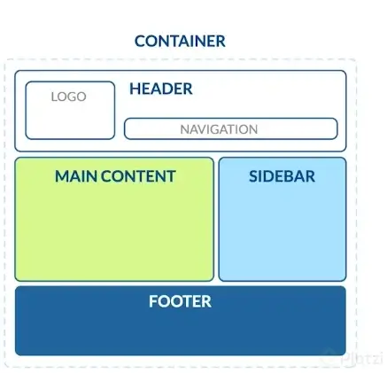
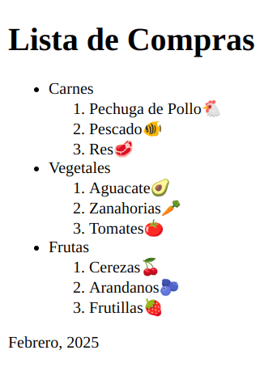
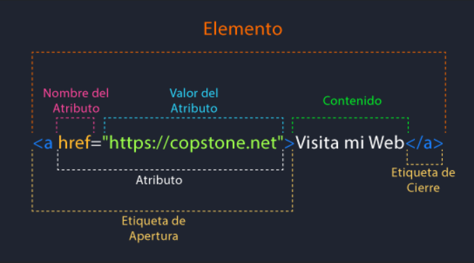

# HTML

HTML (HyperText Markup Language) es un lenguaje de marcado de texto. Se utiliza para darle una estructura al sitio web que estás visitando. Es un lenguaje interpretado.

---

### Estructura básica de HTML en una página Web

<p align="center">
  
</p>

- Container: Contenedor principal
- Header: Cabecera de la página. Aquí usualmente encuentras el logo y el menú de navegación del sitio.
- Main content: Estructura principal. Por ejemplo, el feed o lista de publicaciones de una red social.
- Sidebar: Contenido secundario de una página, que usualmente se encuentra a los lados del contenido principal (o main).
- Footer: Pie de página. Esto se encuentra al fondo del sitio web, salvo en casos de sitios web donde el scroll (o navegación hacia abajo) es infinito, por ende, no tendría sentido ponerlo al fondo.

---

### Index y su estructura básica: head

El primer archivo .html en tu proyecto debe llamarse `index.html`, es la primera pagina que va abrir el servidor, por default, al abrir tu proyecto.
Si no lo haces e `index.html` no existe, el servidor te devolvera toda la estructura de carpetas de archivos de tu proyecto.

En el `head` van todos los metadatos importantes para que el navegador pueda cargar el proyecto. Esto no es visual para el usuario.

``` html
<!DOCTYPE html>
<html lang= "es"> 
    <head>
        <meta charset= "UTF-8" />
        <meta name="description" content="Esta pagina te mostrara fotos de gatos" />
        <meta name="robots" content="index,follow"/>
        <title>Es mi pagina</title>
        <meta name="viewport" content="width=device-width, initial-scale=1.0"/>
        <link rel="stylesheet" href="../css/styles.css">
    </head>
</html>
```
---

### Index y su estructura básica: body

El `body` es la etiqueta que identifica la parte visible de nuestro sitio web. Dentro del `body`, se añadirán las etiquetas para marcar los elementos visuales del sitio web, como logotipo, menús de navegación, contenido principal, entre otros.

```html

<!DOCTYPE html>
<html lang= "es"> 
    <body>
        <header>
            <nav>
            </nav>
        </header>
        <main>
            <section>
                <article>
                <h1></h1>
                <p></p> <!--Parrafo-->
                <a href="#">Link</a>
                </article>
            </section>
            <ul> <!--Lista Desordenada-->
                <li>item</li>
            </ul>
            <ol> <!--Lista Ordenada-->
            </ol>
        </main>
        <footer>
        </footer>
    </body>
</html>

```

---

### Practica: Lista de Compras

**Codigo**

``` html

<!DOCTYPE html>
<html lang= "es"> 
    <head>
        <meta charset= "UTF-8" />
        <meta name="description" content="Esta pagina es mi lista de compras" />
        <meta name="robots" content="index,follow"/>
        <title>Lista de Compras</title>
        <meta name="viewport" content="width=device-width, initial-scale=1.0"/>
        <link rel="stylesheet" href="../css/styles.css">
    </head>
    <body>
        <main>
            <h1>Lista de Compras</h1>
            <ul>
                <li>Carnes</li>
                    <ol>
                        <li>Pechuga de Pollo🐔</li>
                        <li>Pescado🐠</li>
                        <li>Res🥩</li>
                    </ol>
                <li>Vegetales</li>
                    <ol>
                        <li>Aguacate🥑</li>
                        <li>Zanahorias🥕</li>
                        <li>Tomates🍅</li>
                    </ol>
                <li>Frutas</li>
                    <ol>
                        <li>Cerezas🍒</li>
                        <li>Arandanos🫐</li>
                        <li>Frutillas🍓</li>
                    </ol>
            </ul>
        </main>
        <footer>
            <p>Febrero, 2025</p>
        </footer>
    </body>
</html>

```
**Output**

<p align="center">
  
</p>

---

### Anatomía de una etiqueta de HTML

<p align="center">
  
</p>

---

### Tipos de imágenes

**Lossless (Sin pérdida)**

No pierden informacion. Pueden comprimirse, pero se podrá reconstruir su imagen al estado original.

Ejemplos:

- GIF (No se puede comprimir) (Ideal para animaciones simples)
- PNG 8 (Ideal para iconos) (Permite uso de transparencias)
- PNG 24
- SVG (Vector) (Ideal para logotipos y graficos)

**Lossy (Con pérdida)**

Pierden informacion. Por lo que pueden reducir su tamaño, son mas livianos que los archivos lossless. Son ideales para usar en sitios, donde el tamaño del archivo y la velocidad de descarga son importantes.

Ejemplos: 

- JPG/JPEG (Ideal para imagenes fijas y fotografias) (Optimas para la carga en una pagina web) 

---
### Optimizacion de imagenes

El tamaño optimo de una imagen para la web es de 70KB, en promedio. 
Para alcanzar este tamaño puedes usar paginas como: 

- [TinyPNG](https://tinypng.com/) (Comprime imagenes)
- [verexif](https://www.verexif.com/) (Elimina los metadatos de una imagen)
