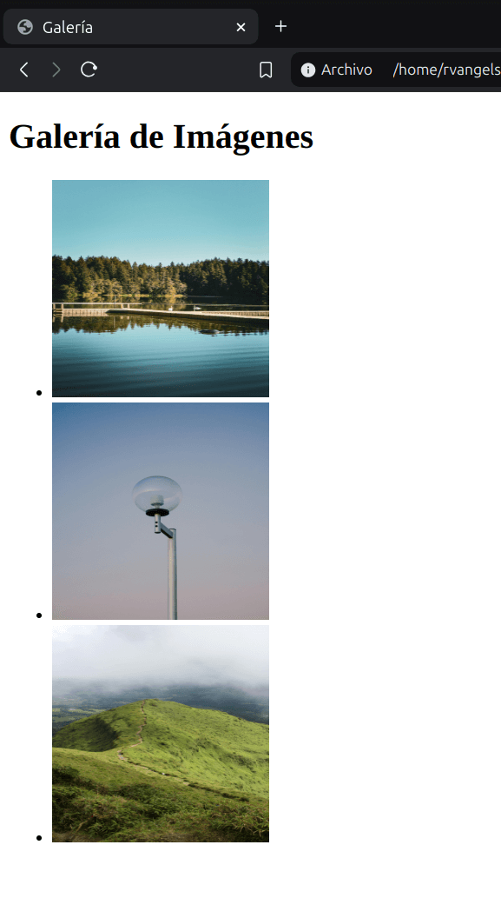
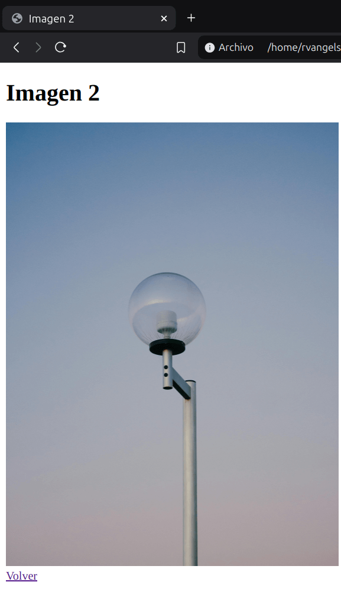

# Imágenes

```html

<body>  <!-- Es recomendable ajustar las imagenes con CSS -->
     <!-- Puede terminar en ">" o "/>" -->
    <br />
    
    <br />
    
</body>

```
OJO: WEBP está convirtiéndose en el nuevo estándar para imágenes raster.

OJO: Para mejorar el rendimiento y la velocidad de carga de tu sitio web, asegúrate de redimensionar y comprimir tus imágenes antes de subirlas.

### Resolucion
```html
 <!-- El atributo "srcset" escoge la resolucion perfecta para nuestra pantalla -->
```

OJO: Es recomendable soportar 3 resoluciones (móvil, ipad, y escritorio) y las últimas 3 versiones de los navegadores más usados (Chrome, Firefox, Safari y Edge). 

### Figura
```html
<!-- Ayuda a la semántica para los buscadores -->
<figure>
    
    <figcaption>Este es es logo de HTML5</figcaption>
</figure>
```

## Foto
```html
<picture> <!-- Sirve para condicionar las imagenes que se usara dada una resolucion -->
    <source media="(min-width:1200px)" srcset="assets/arches-1200.jpg">
    <source media="(min-width:600px)" srcset="assets/arches-600.jpg">
    
</picture>
```

### Tipos de imágenes:

**Lossless (Sin pérdida)**

No pierden informacion. Pueden comprimirse, pero se podrá reconstruir su imagen al estado original.

Ejemplos:

- GIF (No se puede comprimir) (Ideal para animaciones simples)
- PNG 8 (Ideal para iconos) (Permite uso de transparencias)
- PNG 24
- SVG (Vector) (Ideal para logotipos y graficos)

**Lossy (Con pérdida)**

Pierden informacion. Por lo que pueden reducir su tamaño, son mas livianos que los archivos lossless. Son ideales para usar en sitios, donde el tamaño del archivo y la velocidad de descarga son importantes.

Ejemplos: 

- JPG/JPEG (Ideal para imagenes fijas y fotografias) (Optimas para la carga en una pagina web) 

---
### Optimizacion de imagenes

El tamaño optimo de una imagen para la web es de 70KB, en promedio. 

Para alcanzar este tamaño puedes usar paginas como: 

- [TinyPNG](https://tinypng.com/) (Comprime imagenes)
- [verexif](https://www.verexif.com/) (Elimina los metadatos en una imagen)

Puedes obtener imagenes gratuitas para tus proyectos en:

- [pexels](https://www.pexels.com/es-es/)
- [unsplash](https://unsplash.com/es)

---

### Practica 4: Galeria

**Codigo**

```html
<!DOCTYPE html>
<html lang="es">
<head>
    <meta charset="UTF-8">
    <meta name="viewport" content="width=device-width, initial-scale=1.0">
    <title>Galería</title>
</head>

    
<body>
    <header>
        <h1>Galería de Imágenes</h1>
    </header>
    <main>
        <section>
            <ul>
                <li><a href="imagen1.html"></a></li>
                <li><a href="imagen2.html"></a></li>
                <li><a href="imagen3.html"></a></li>
            </ul>
        </section>
    </main>
</body>
</html>
```

**Output**

<p>
  
  
</p>
