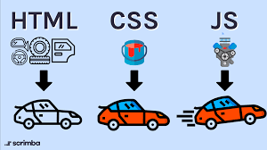

# Introduccion

### HTML

HTML sirve para crear la estructura de los documentos que se visualizan en los navegadores, a traves de etiquetas. De esa manera, presentamos: Barras de Navegación, Secciones, artículos, listas, títulos de diferentes tamaños, audios, videos, imágenes, entre otros. Podemos imaginarlo como la descripcion de las piezas de un auto.

### CSS

Es el lenguaje con el que le damos estilos a todo el contenido previamente etiquetado con HTML. Siguiendo la analogia del auto, podemos pensarlo como su pintura y adornos.

### JavaScript

Es lenguaje que se emplea para crear o brindar a las páginas web la capacidad de interactuar con el usuario y los recursos asociados a una página web, como lo son: bases de datos, servidores de diversa índole, información derivada de la interacción de cada página en sí. Finalmente, seria el mecanismo detras del funcionamiento de un auto, es decir, la interaccion entre sus piezas.

### Relacion entre HTML-CSS-JS

  

---

### Páginas Estáticas vs. Dinámicas

**Páginas Estáticas**
La información que contiene se mantiene constante y estática. No se actualiza con la interacción del usuario. Es conveniente para realizar landing pages (páginas informativas o de aterrizaje) o blogs. Se mostrarán siempre iguales para todos los usuarios.

  

**Ejemplos de páginas estáticas:**
- Menú de un restaurante
- Blog de viajes
- Página informativa de un negocio

**Páginas Dinámicas**
También conocidos como aplicaciones web, actualizan su información con respecto a la interacción del usuario. Dependen de una base de datos, de donde extrae e ingresa información. Serán diferentes, dependiendo del usuario que la use y la información que se ingrese.

  

**Ejemplos de páginas dinámicas:**
- Sistema de reporte de ventas
- Linkedin
- Banca en línea
