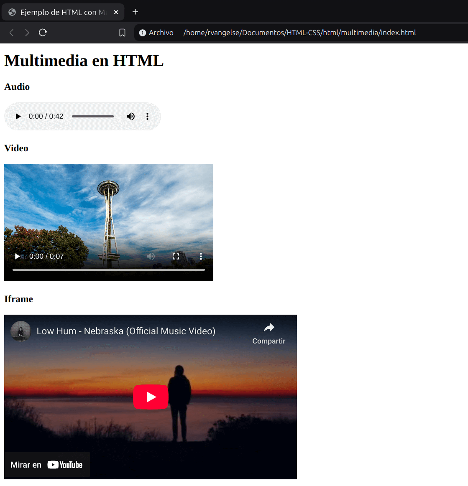

# Multimedia

### Audio
```html

<audio controls src="audio.mp3" loop autoplay></audio>

<!-- Se puede usar "source" como en imagenes -->
<audio controls loop autoplay>
    <source src="audio.mp3" type="audio/mpeg">
    <source src="audio.ogg" type="audio/ogg; codec=opus">
    Lo sentimos. Tu navegador no soporta este formato.
</audio>
```

OJO: Los navegadores más populares soportan mp3 por lo que podrías omitir otras opciones de audio.

### Video
```html
<video controls src="video.mp4"></video>

<!-- Puede usarse "source" al igual que en audio o imagenes -->
<video controls loop autoplay>
    <source src="video.mp4" type="video/mp4">
    <source src="video.webm" type="video/webm">
    <!-- Subtítulos: Requeridos por la ley en algunos lugares -->
    <track src="video.es.vtt" kind="subtitles" label="Español" srclang="es" default></track>
    <track src="video.en.vtt" kind="captions" label="English" srclang="en" ></track>
    <!-- Descripciones para accesibilidad -->
    <track src="descriptions.en.vtt" kind="descriptions" label="Descriptions" srclang="en"></track>
    <!-- Capítulos -->
    <track src="chapters.en.vtt" kind="chapters" label="Capítulos" srclang="es"></track>
    Lo sentimos. Tu navegador no soporta este formato.
</video>
```
OJO: El mejor formato de video para internet y HTML5 es H.264 (MP4). El futuro será WebM o AV1.

### Marco

El elemento `<iframe>` una página web dentro de otra. Se pueden pensar como widgets.

Sirve para incorporar partes de una pagina web externa a tu propia pagina. 

```html
<!-- De Google Maps, YouTube, Facebook | Seguridad -->
<iframe width="560" height="315" src="https://www.youtube.com/embed/Du0NkUb1qdw?si=_D4HndKypWyTQAxc" title="YouTube video player" frameborder="0" allow="accelerometer; autoplay; clipboard-write; encrypted-media; gyroscope; picture-in-picture; web-share" referrerpolicy="strict-origin-when-cross-origin" allowfullscreen></iframe>
```
OJO: Establece las dimensiones (alto y ancho) del iframe y asegúrate de utilizar iframes con contenido confiable y seguro.

---

### Practica 5: Multimedia en HTML

**Codigo**
```html
<!DOCTYPE html>
<html lang="es">
<head>
    <meta charset="UTF-8">
    <meta name="viewport" content="width=device-width, initial-scale=1.0">
    <title>Ejemplo de HTML con Multimedia</title>
</head>
<body>
    <header>
        <h1>Multimedia en HTML</h1>
    </header>
    <main>
        <section>
            <h3>Audio</h3>
            <audio controls src="src/audio.mp3"></audio>
        </section>
        <section>
            <h3>Video</h3>
            <video controls width="400" src="src/video.mp4"></video>
        </section>
        <section>
            <h3>Iframe</h3>
            <iframe width="560" height="315" src="https://www.youtube.com/embed/Du0NkUb1qdw?si=UrVo_DRh4C5wSSyI" title="YouTube video player" frameborder="0" allow="accelerometer; autoplay; clipboard-write; encrypted-media; gyroscope; picture-in-picture; web-share" referrerpolicy="strict-origin-when-cross-origin" allowfullscreen></iframe>
        </section>
    </main>
</body>
</html>
```
**Output**

<p align="center">
  
</p>
