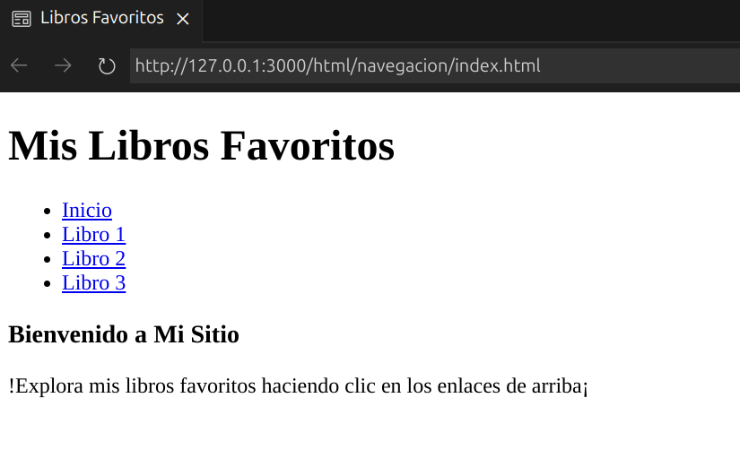
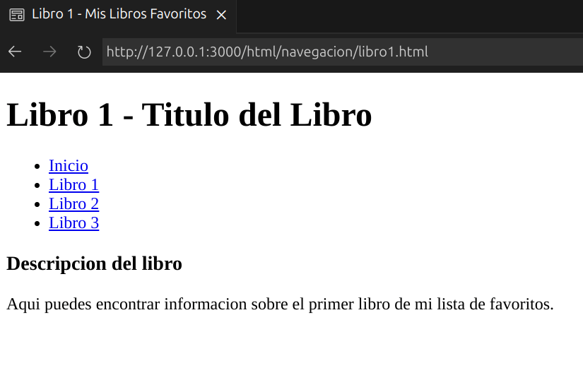

# Navegacion

### Vinculos
```html

<!-- Enlace a otra pagina -->
<p><a href="ciudad.html">Ir a Mi Ciudad Favorita</a></p> 

<!-- Enlace a otra seccion dentro de la misma pagina -->
<p><a href="#ancla">Ir a ancla</a></p>
<!-- Simulación de bastante contenido -->
</img>
<section id="ancla">Ancla</section>
</img>
```
OJO: Si deseas abrir el vínculo en una nueva página, puedes usar el atributo target='_blank'

### Rutas
```html
<!-- Vínculos Relativos -->
<a href="./about.html">About</a> <!-- Relativo a la carpeta actual, se puede omitir el "." -->
<a href="../index.html">Index</a> <!-- Ralativo a la carpeta padre -->

<!-- Vínculo Absoluto -->
<a href="https://www.google.com/">Google</a>

```

OJO: Es recomendable usar rutas relativas cuando sea posible, a menos que desees apuntar a una página externa. 

OJO: Puedes usar la etiqueta `<base>` para asignar una ruta y relacionar al resto de tus archivos, de forma relativa.

OJO: Una buena forma de documentar la estructura de tu sitio es usando un archivo [sitemap](https://developers.google.com/search/docs/crawling-indexing/sitemaps/build-sitemap?hl=es).

### Barras
```html
<!-- Barras de Navegación -->
<nav role="navigation" aria-label="menú principal">
    <a href="/">Hogar</a> <!-- Este enlace te lleva a la pagina principal de tu dominio-->
    <a href="/blog.html">Blog</a>
    <a href="/sections/about.html">Acerca De</a>
</nav>

<!-- El footer tambien sirve para navegar -->
<footer>
    <a href="/">Hogar</a>
    <a href="/blog.html">Blog</a>
    <a href="/sections/about.html">Acerca De</a>
</footer>
```
OJO: Al utilizar la etiqueta `<nav>`, asegúrate de que su contenido esté relacionado con la navegación principal de tu sitio web, como menús y enlaces que guían a los usuarios a diferentes secciones. 

---
### Practica 3: Mis Libros Favoritos

**Codigo**

```html 
<!--Index-->

<!DOCTYPE html>
<html lang="es">
<head>
    <meta charset="UTF-8">
    <meta name="viewport" content="width=device-width, initial-scale=1.0">
    <title>Libros Favoritos</title>
</head>
<body>
    <header>
        <h1>Mis Libros Favoritos</h1>
        <nav>
            <ul>
                <li><a href="index.html">Inicio</a></li>
                <li><a href="libro1.html">Libro 1</a></li>
                <li><a href="libro2.html">Libro 2</a></li>
                <li><a href="libro3.html">Libro 3</a></li>
            </ul>
        </nav>
    </header>
    <main>
        <section>
            <h3>Bienvenido a Mi Sitio</h3>
            <p>!Explora mis libros favoritos haciendo clic en los enlaces de arriba¡</p>
        </section>
    </main>
</body>
</html>

<!-- Libro 1 -->

 <!DOCTYPE html>
<html lang="es">
<head>
    <meta charset="UTF-8">
    <meta name="viewport" content="width=device-width, initial-scale=1.0">
    <title>Libro 1 - Mis Libros Favoritos</title>
</head>
<body>
    <header>
        <h1>Libro 1 - Titulo del Libro</h1>
        <nav>
            <ul>
                <li><a href="index.html">Inicio</a></li>
                <li><a href="libro1.html">Libro 1</a></li>
                <li><a href="libro2.html">Libro 2</a></li>
                <li><a href="libro3.html">Libro 3</a></li>
            </ul>
        </nav>
    </header>
    <main>
        <section>
            <h3>Descripcion del libro</h3>
            <p>Aqui puedes encontrar informacion sobre el primer libro de mi lista de favoritos.</p>
        </section>
    </main>
</body>
</html>
```
**Output**
<p>
  
  
</p>
