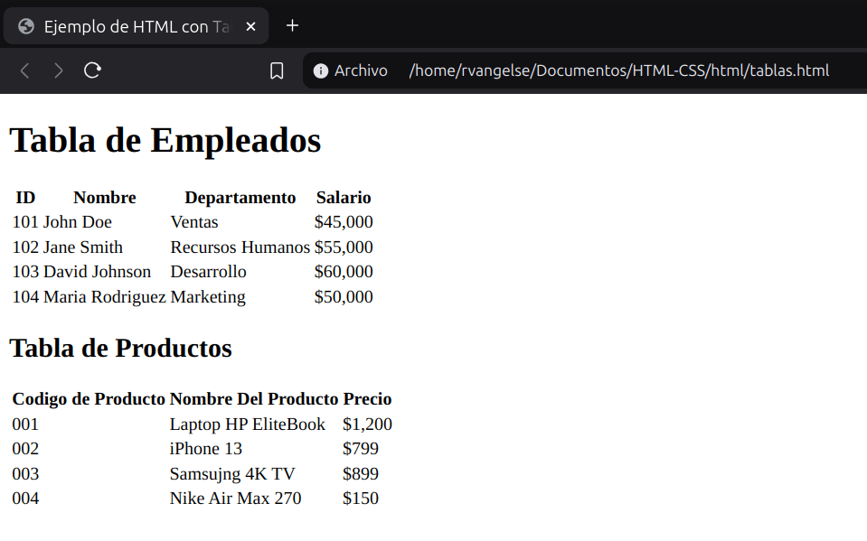

# Tablas
```html
<table>
    <tr><!-- 1era fila-->
        <th>Tecnología Web</th> <!-- 1era columna-->
        <th>Función</th> <!-- 2da columna-->
        <th>Logo</th> <!-- 3ra columna-->
    </tr>
    <tr> <!-- 2da fila-->
        <td>HTML</td>
        <td>Estructura</td>
        <td></td>
    </tr>
    <tr> <!-- 3ra fila-->
        <td>CSS</td>
        <td>Estilo</td>
        <td></td>
    </tr>
    <tr> <!-- 4ta fila-->
        <td>JavaScript</td>
        <td>Interactividad</td>
        <td></td>
    </tr>
</table>
```
OJO: Usa tablas en HTML exclusivamente para mostrar datos organizados en filas y columnas.

---
### Practica 7: Tablas en HTML

**Codigo**
```html
<!DOCTYPE html>
<html lang="es">
<head>
    <meta charset="UTF-8">
    <meta name="viewport" content="width=device-width, initial-scale=1.0">
    <title>Ejemplo de HTML con Tablas</title>
</head>
<body>
    <header>
        <h1>Tabla de Empleados</h1>
    </header>
    <main>
        <section>
            <table>
                <tr>
                    <th>ID</th>
                    <th>Nombre</th>
                    <th>Departamento</th>
                    <th>Salario</th>
                </tr>
                <tr>
                    <td>101</td>
                    <td>John Doe</td>
                    <td>Ventas</td>
                    <td>$45,000</td>
                </tr>
                <tr>
                    <td>102</td>
                    <td>Jane Smith</td>
                    <td>Recursos Humanos</td>
                    <td>$55,000</td>
                </tr>
                <tr>
                    <td>103</td>
                    <td>David Johnson</td>
                    <td>Desarrollo</td>
                    <td>$60,000</td>
                </tr>
                <tr>
                    <td>104</td>
                    <td>Maria Rodriguez</td>
                    <td>Marketing</td>
                    <td>$50,000</td>
                </tr>
            </table>
        </section>
        <section>
            <h2>Tabla de Productos</h2>
            <table>
                <tr>
                    <th>Codigo de Producto</th>
                    <th>Nombre Del Producto</th>
                    <th>Precio</th>
                </tr>
                <tr>
                    <td>001</td>
                    <td>Laptop HP EliteBook</td>
                    <td>$1,200</td>
                </tr>
                <tr>
                    <td>002</td>
                    <td>iPhone 13</td>
                    <td>$799</td>
                </tr>
                <tr>
                    <td>003</td>
                    <td>Samsujng 4K TV</td>
                    <td>$899</td>
                </tr>
                <tr>
                    <td>004</td>
                    <td>Nike Air Max 270</td>
                    <td>$150</td>
                </tr>
            </table>
        </section>
    </main> 
</body>
</html>
```

**Output**

<p align="center">
  
</p>
