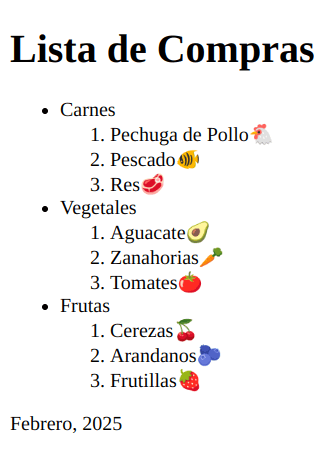
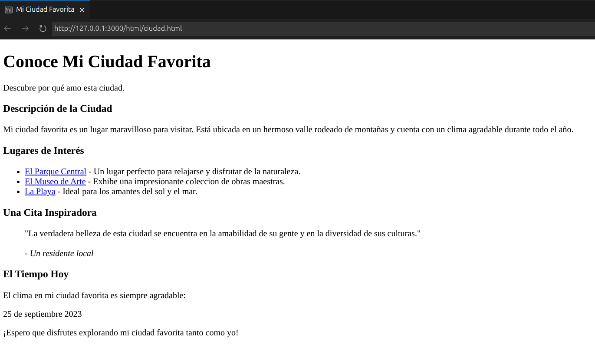

# Texto

### Texto Semantico

Etiquetas que ayudan a dar más significado a palabras o frases.

``` html
<!-- Ejemplos: -->
<p>Párrafo (Elemento de Bloque)</p>
<em>Énfasis</em>
<i>Voz alternativa</i>
<b>Atención utilitaria</b>
<strong>Gran importancia</strong>
<small>Pequeño comentario</small>
<span>Uso con atributos (Elemento de Línea)</span>

<!-- Truco para evitar salto de línea -->
<p>Estas&nbsp;palabras&nbsp;no&nbsp;saltan&nbsp;líneas&nbsp;en&nbsp;ventanas&nbsp;pequeñas</p>

```
### Encabezados

``` html
<!-- Encabezados -->
<h1>Título</h1>
<h2>Subtítulo</h2>
<h3>Subtítulo</h3>
<h4>Subtítulo</h4>
<h5>Subtítulo</h5>
<h6>Subtítulo</h6>
```
OJO: Es una buena practica tener un solo titulo por pagina. 

### Listas
```html
<!-- Listas desordenadas -->
<ul>
    <li>HTML</li>
    <li>CSS</li>
    <li>JavaScript</li>
</ul>
<!-- Listas ordenadas -->
<ol>
    <li>HTML</li>
    <li>CSS</li>
    <li>JavaScript</li>
</ol>
<!-- Listas de definición -->
<dl>
    <dt>HTML</dt>
    <dd>Es un lenguaje de marcado de texto.</dd>
    <dd>Se utiliza para el desarrollo de páginas de Internet.</dd>
</dl>
```
OJO: Es recomendable el uso de listas anidadas, si las listas son demasiado largas.

### Formato

``` html

<!-- Codigo -->
<p>Utiliza este código en CSS:
    <code>{ background: blue; }</code>
</p>

<p>Utiliza este código en HTML:
    <code>&lt;body&gt;</code>
</p>

<!-- Superíndice y subíndice -->
<p>CO<sub>2</sub></p>
<p>n<sup>2</sup></p>
<p>Referencia a un libro.<sup>1</sup></p>

```
### Citas

``` html
<blockquote> <!--En bloque-->
    Primero, las máquinas harán muchos trabajos por nosotros y no serán súper inteligentes. Eso debería ser positivo si lo gestionamos bien. Unas décadas después de eso, la IA puede ser bastante fuerte como para ser una preocupación. <sup>[1]</sup>
</blockquote>
<p>1."<cite>Bill Gates dice que deberías preocuparte por la inteligencia artificial</cite>". Forbes. Febrero de 2015.</p>


<p>José Mujica dijo: <!--En linea (Citas Cortas)-->
    <q>Ser libre es gastar la mayor cantidad de tiempo de nuestra vida en aquello que nos gusta hacer.</q>
</p>

```
### Tiempo 

```html 

<!-- Fechas y Tiempo -->
<p>Nos vemos a las 
    <time datetime="2024-04-20 10:00-0800">10</time>
</p>

```
---

### Practica 1: Lista de Compras

**Codigo**

``` html

<!DOCTYPE html>
<html lang= "es"> 
    <head>
        <meta charset= "UTF-8" />
        <meta name="description" content="Esta pagina es mi lista de compras" />
        <meta name="robots" content="index,follow"/>
        <title>Lista de Compras</title>
        <meta name="viewport" content="width=device-width, initial-scale=1.0"/>
        <link rel="stylesheet" href="../css/styles.css">
    </head>
    <body>
        <main>
            <h1>Lista de Compras</h1>
            <ul>
                <li>Carnes</li>
                    <ol>
                        <li>Pechuga de Pollo🐔</li>
                        <li>Pescado🐠</li>
                        <li>Res🥩</li>
                    </ol>
                <li>Vegetales</li>
                    <ol>
                        <li>Aguacate🥑</li>
                        <li>Zanahorias🥕</li>
                        <li>Tomates🍅</li>
                    </ol>
                <li>Frutas</li>
                    <ol>
                        <li>Cerezas🍒</li>
                        <li>Arandanos🫐</li>
                        <li>Frutillas🍓</li>
                    </ol>
            </ul>
        </main>
        <footer>
            <p>Febrero, 2025</p>
        </footer>
    </body>
</html>

```
**Output**

<p align="center">
  
</p>

---
### Practica 2: Mi Ciudad Favorita

**Codigo**

``` html
<!DOCTYPE html>
<html lang="es">
  <head>
    <meta charset="UTF-8" />
    <meta name="viewport" content="width=device-width, initial-scale=1.0" />
    <title>Mi Ciudad Favorita</title>
  </head>
  <body>
    <header>
      <h1>Conoce Mi Ciudad Favorita</h1>
      <p>Descubre por qué amo esta ciudad.</p>
    </header>
    <main>
      <section>
        <h3>Descripción de la Ciudad</h3>
        <p>
          Mi ciudad favorita es un lugar maravilloso para visitar. Está ubicada
          en un hermoso valle rodeado de montañas y cuenta con un clima
          agradable durante todo el año.
        </p>
      </section>
      <section>
        <h3>Lugares de Interés</h3>
        <ul>
          <li>
            <a href="#">El Parque Central</a> - Un lugar perfecto para relajarse
            y disfrutar de la naturaleza.
          </li>
          <li>
            <a href="#">El Museo de Arte</a> - Exhibe una impresionante
            coleccion de obras maestras.
          </li>
          <li>
            <a href="#">La Playa</a> - Ideal para los amantes del sol y el mar.
          </li>
        </ul>
      </section>
      <section>
        <h3>Una Cita Inspiradora</h3>
        <blockquote>
          "La verdadera belleza de esta ciudad se encuentra en la amabilidad de
          su gente y en la diversidad de sus culturas." <br />
          <br />
          <cite>- Un residente local</cite>
        </blockquote>
      </section>
    </main>
    <footer>
      <section>
        <h3>El Tiempo Hoy</h3>
        <p>El clima en mi ciudad favorita es siempre agradable:</p>
        <time daytime="2023-09-5">25 de septiembre 2023</time>
        <p>
          ¡Espero que disfrutes explorando mi ciudad favorita tanto como yo!
        </p>
      </section>
    </footer>
  </body>
</html>
```
**Output**

<p align="center">
  
</p>

